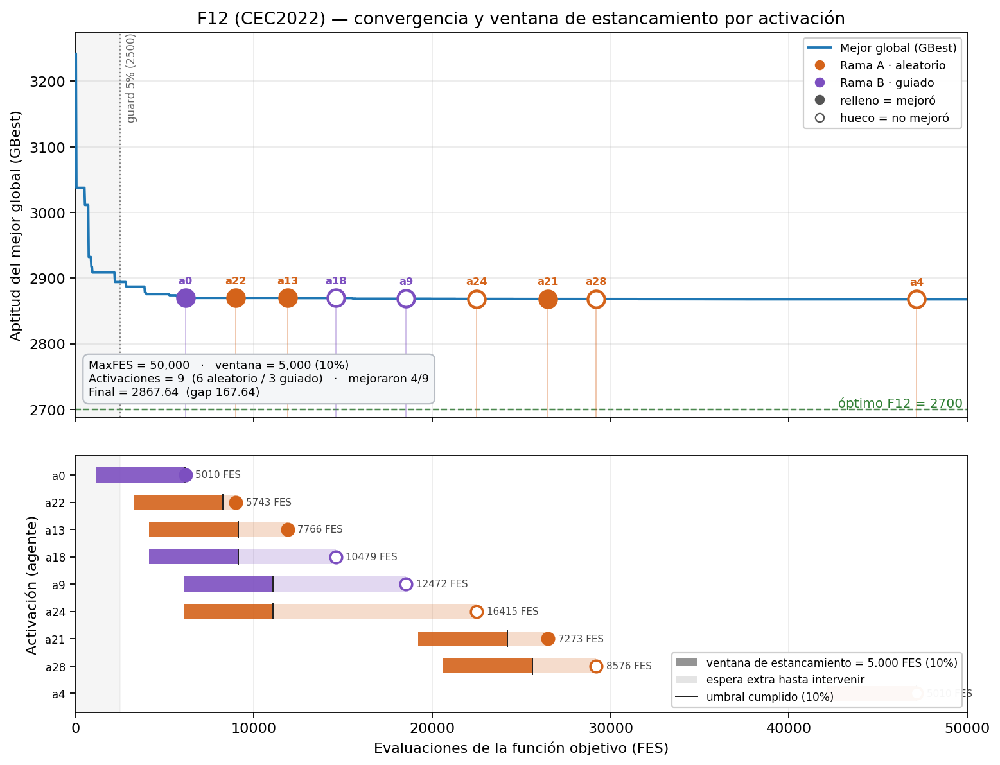

# Informe — Detección de estancamiento e intervención SHAP

**Proyecto:** Walrus Optimizer (WO) con controlador SHAP por agente
**Fecha:** 2026-05-22
**Fuente de datos:** `experiments/test_report/` (telemetría real) y `experiments/F12_estancamiento/`
**Alcance de esta corrida:** 5 corridas por problema · MaxFES = 50.000 · CEC2022 (F1–F12, dim 10) + TMLAP (simple/mediana/dura)

> **Aviso de validez.** Las cifras son **preliminares**: 5 corridas y un solo MaxFES (50.000), no el protocolo completo (51 corridas × {5·10³, 5·10⁴, 5·10⁵, 5·10⁶} con Friedman/Wilcoxon). Sirven para auditar el **comportamiento** del controlador, no para concluir superioridad estadística.

---

## 1. Resumen ejecutivo

- El detector de estancamiento es **FES-native y por agente**: marca a un agente como estancado cuando lleva ≥ **10 % de MaxFES** (5.000 FES) sin mejorar su mejor personal.
- **Detección ≫ intervención.** En CEC el detector señaló estancamiento (con agente bloqueado) en **52.646** iteraciones, pero solo **538** terminaron en intervención SHAP. Las compuertas —sobre todo los *cooldowns* adaptativos— filtran ~99 % de las detecciones, evitando un controlador "nervioso".
- **SHAP se calcula on-demand y es barato en el balance global:** ~**3,4–4,7 % de MaxFES** por corrida (≈ 9–12 explicaciones × 192 FES).
- **La bifurcación funciona y la rama guiada rinde más.** En CEC la Rama B (reinit guiado por SHAP) mejoró al agente el **52,5 %** de las veces frente al **32,8 %** de la Rama A (reinit aleatorio). El patrón se repite en TMLAP mediana y dura.
- **`safety_signal` es la señal que más explica el fitness** de los agentes estancados, seguida de `danger_signal` y `alpha`. La señal `A` recibe contribución **0** (no entra en el movimiento single-agent) — hallazgo de validación, ver §6.3.
- **Efecto preliminar sobre el rendimiento:** en CEC, WO+SHAP mejora la media (4.816 vs 5.032) y gana en 5/12 funciones; en TMLAP dura mejora (277,4 vs 279,6) y empata en simple/mediana.

---

## 2. Configuración del controlador

Configuración **única y fija** (sin perfiles), conforme al setup experimental. Definida en `shap_controller/profiles.py`.

| Parámetro | Valor | Significado |
|---|---|---|
| Ventana de estancamiento | **10 % de MaxFES** (5.000) | FES sin mejora para marcar a un agente como estancado |
| `guard_window` | 5 % (2.500) | no se interviene antes de este FES |
| `late_fes` | 95 % (47.500) | no se interviene después de este FES |
| `action_cooldown` | 5 % (2.500) | espera mínima entre intervenciones del **mismo** agente |
| `shap_budget` | 5 % (2.500) | tope de FES gastables en SHAP por corrida |
| `contribution_threshold` | **0,90** | share de la señal dominante para elegir Rama B |
| `amplification_factor` | 2,0 | amplificación de la señal dominante en Rama B |
| `shapley_steps` | 3 | pasos simulados por coalición en la value function |
| Coaliciones SHAP | 2⁶ = **64** | SHAP exacto sobre las 6 señales de control |

Las 6 señales explicadas: `alpha, beta, A, R, danger_signal, safety_signal`.

---

## 3. Mecanismo de detección de estancamiento

### 3.1 Cómo funciona
La detección es **por agente** y se mide en FES (no en iteraciones). Cada agente tiene una marca `last_improve_fes[i]` con el FES de su última mejora real de `pbest`. El "reloj" es una resta:

```
fes_since_improve[i] = budget.total − last_improve_fes[i]
```

Un agente está **estancado** si `fes_since_improve[i] ≥ 10 % de MaxFES`. Referencias:
`runners/run_wo_shap.py:163` (inicialización), `:191-193` (reinicio al mejorar `pbest`), `:215` (cálculo del reloj), `:272` (reinicio tras intervención).

Detalles que conviene tener presentes:
- El reloj **arranca en la primera evaluación** de cada agente, no en la inicialización: la init nunca cuenta como estancamiento.
- Solo reinicia el reloj una **mejora real del mejor personal** (supera `improvement_threshold`), no cualquier cambio ni mejorar respecto a la iteración previa.
- Como el presupuesto sube +N (=30) por iteración, **5.000 FES ≈ 167 iteraciones**: es imposible que el detector dispare antes del FES 5.000.

### 3.2 Cuándo se activó (datos)

| Familia | 1ª activación (FES, prom) | `fes_since_improve` mediana | máx | Interpretación |
|---|---|---|---|---|
| CEC2022 | 5.425 | 9.677 | 30.944 | dispara justo tras la ventana; estancamientos moderados |
| TMLAP simple | 5.755 | 23.838 | 46.266 | agentes pasan mucho más tiempo estancados |
| TMLAP mediana | 6.273 | 23.465 | 43.883 | ídem |
| TMLAP dura | 8.034 | 13.136 | 30.464 | 1ª activación más tardía (init consume FES) |

El mínimo de `fes_since_improve` es **5.010** en todas las familias (≈ ventana 5.000 + una iteración de 30 agentes): confirma que el umbral del 10 % dispara con precisión.

### 3.3 Detección vs bloqueo (el filtrado de las compuertas)

El detector señala estancamiento **muchísimo más** de lo que se interviene. Cada "non-event" es una iteración con un agente estancado que fue **bloqueado** por una compuerta:

| Familia | Intervenciones | Detecciones bloqueadas | Causa principal del bloqueo |
|---|---|---|---|
| CEC2022 | 538 | **52.646** | cooldown adaptativo (32.886) + effective (16.482) |
| TMLAP simple | 61 | 7.003 | cooldown adaptativo (4.790) + effective (1.660) |
| TMLAP mediana | 59 | 6.884 | cooldown adaptativo (5.680) |
| TMLAP dura | 56 | 6.284 | cooldown adaptativo (5.251) |

**Lectura:** una vez que la población entra en estancamiento generalizado (segunda mitad del presupuesto), casi todas las iteraciones tienen agentes estancados, pero los *cooldowns* impiden re-intervenir constantemente. Son las compuertas —no la detección— las que regulan la frecuencia real de actuación.

> Matiz para escribir en la tesis: si el profesor pide "cuántas veces se detectó estancamiento" en sentido estricto, la respuesta es **detecciones = intervenciones + bloqueos**; si pide "cuántas veces se actuó", es solo **intervenciones**.

---

## 4. Mecanismo de intervención SHAP

### 4.1 Cuándo se dispara
SHAP se calcula **on-demand**, solo cuando un agente (a) está estancado y (b) pasa todas las compuertas de `should_consider_intervention` (`shap_controller/controller.py:179-217`). No es periódico ni global. Orden de filtrado: primero lo barato (¿estancado? ¿compuertas?), y solo entonces se paga el SHAP caro. SHAP **no decide si** intervenir (ya está decidido) — decide **cómo** (qué rama).

### 4.2 Costo
Cada explicación cuesta **64 coaliciones × 3 pasos = 192 FES** (`wo_core/agent_sim.py:27-29`), simulando **un solo agente** con la población congelada (no barre la población). En el balance global es modesto:

| Familia | FES SHAP / corrida | % de MaxFES | Intervenciones / corrida |
|---|---|---|---|
| CEC2022 | 1.722 | 3,4 % | 9,0 |
| TMLAP simple | 2.342 | 4,7 % | 12,2 |
| TMLAP mediana | 2.266 | 4,5 % | 11,8 |
| TMLAP dura | 2.150 | 4,3 % | 11,2 |

### 4.3 Bifurcación (Rama A / Rama B)
Tras el SHAP, `decide()` calcula el *share* de la señal dominante (`|SHAP_i| / Σ|SHAP_j|`):
- `share ≥ 0,90` → **Rama B** (`reinit_guided`): un paso WO desde la posición actual con la señal dominante amplificada (×2).
- en otro caso → **Rama A** (`reinit_random`): reinit uniforme `lb + (ub−lb)·rand`.

El reinit se aplica **siempre**; el GBest se preserva (solo mejora).

---

## 5. Resultados — Intervención

### 5.1 Reparto de ramas y eficacia

| Familia | Activaciones | Rama A | Rama B | Mejora total | Mejora A | Mejora B |
|---|---|---|---|---|---|---|
| CEC2022 | 538 | 296 | 242 | 41,6 % | 32,8 % | **52,5 %** |
| TMLAP simple | 61 | 50 | 11 | 32,8 % | 36,0 % | 18,2 % |
| TMLAP mediana | 59 | 42 | 17 | 15,3 % | 9,5 % | **29,4 %** |
| TMLAP dura | 56 | 37 | 19 | 14,3 % | 5,4 % | **31,6 %** |

**Hallazgo central:** salvo en TMLAP simple, **la Rama B (guiada por SHAP) mejora al agente con más frecuencia que la Rama A (aleatoria)**. Es el argumento empírico a favor de usar SHAP para guiar el reinicio en lugar de reinyectar al azar: cuando hay una señal claramente dominante (share ≥ 0,90), explotarla rinde más que el azar.

> Que "solo" ~40 % de las intervenciones mejoren al agente **no** es un problema: el GBest se preserva, así que las que empeoran no dañan el resultado. La intervención busca diversificar/relanzar al agente estancado, no garantizar mejora inmediata.

### 5.2 Distribución temporal de las activaciones (cuartiles de FES)

| Familia | 0–25 % | 25–50 % | 50–75 % | 75–100 % |
|---|---|---|---|---|
| CEC2022 | 133 | **222** | 117 | 66 |
| TMLAP simple | 13 | 18 | 18 | 12 |
| TMLAP mediana | 10 | 18 | 16 | 15 |
| TMLAP dura | 10 | 15 | 16 | 15 |

En CEC las intervenciones se concentran en la **primera mitad** del presupuesto (exploración media), cuando los agentes empiezan a estancarse pero aún hay margen para relanzarlos. En TMLAP el reparto es más uniforme.

---

## 6. Resultados — Explicabilidad (qué dice SHAP)

### 6.1 Señal dominante por activación (conteo, CEC2022)

| Señal | Veces dominante | % |
|---|---|---|
| `safety_signal` | 186 | 34,6 % |
| `danger_signal` | 133 | 24,7 % |
| `alpha` | 120 | 22,3 % |
| `beta` | 89 | 16,5 % |
| `R` | 10 | 1,9 % |
| `A` | 0 | 0,0 % |

Las señales **de comportamiento** (`safety` + `danger`) explican ~59 % de los casos; el *schedule* (`alpha`) un 22 %.

### 6.2 Importancia agregada (|SHAP| medio, CEC2022)

| Señal | Share del \|SHAP\| total |
|---|---|
| `safety_signal` | **90,6 %** |
| `danger_signal` | 8,6 % |
| `R` | 0,7 % |
| `alpha` | 0,1 % |
| `beta` | 0,0 % |
| `A` | 0,0 % |

> El \|SHAP\| medio está **sesgado por outliers**: unos pocos agentes con fitness gigante (millones–billones) inflan el peso de `safety_signal`. Por eso la métrica robusta para la tesis es el **conteo de §6.1** (frecuencia con que cada señal domina), no este promedio absoluto. Ambas coinciden en que `safety_signal` es la señal más influyente.

### 6.3 Validación: `A` con contribución nula
La señal `A` recibe **SHAP = 0** de forma sistemática. Es coherente y **valida** el cálculo: `A` se computa en `iteration_signals` pero **no entra** en el movimiento single-agent que usa la value function (`wo_core/agent_sim.py` pasa `alpha, beta, R, danger, safety` a `apply_wo_movement_single`, no `A`). Como togglear `A` no cambia el resultado simulado, SHAP le asigna correctamente contribución cero.

**Acción sugerida:** revisar si `A` debe formar parte de las 6 features. Si nunca contribuye en este contexto, podría retirarse (5 features → 2⁵ = 32 coaliciones → SHAP ~2× más barato) o, alternativamente, incorporarse al movimiento si se considera relevante. *Decisión de diseño a discutir con la guía.*

---

## 7. Efecto sobre el rendimiento (base vs SHAP)

| Familia | WO+SHAP gana en | Media base | Media SHAP |
|---|---|---|---|
| CEC2022 | 5 / 12 funciones | 5.032 | **4.816** |
| TMLAP simple | 0 / 1 | 89 | 89 (empate) |
| TMLAP mediana | 0 / 1 | 151 | 151 (empate) |
| TMLAP dura | 1 / 1 | 279,6 | **277,4** |

Lectura honesta: con 5 corridas el controlador **mejora la media** en CEC y en TMLAP dura, y **no empeora** en simple/mediana. No es una victoria contundente y **requiere el protocolo completo** (51 corridas, 4 MaxFES, pruebas de Friedman/Wilcoxon) para concluir. Lo importante de esta auditoría es que el controlador **se comporta como fue diseñado** y **nunca degrada el GBest**.

---

## 8. Caso de estudio — F12 (CEC2022), una corrida

Corrida única de F12 (MaxFES 50.000): `final = 2.867,64`, gap = 167,64 al óptimo 2.700, **9 activaciones** (6 aleatorio / 3 guiado), `fes_shap = 1.728` (3,5 %).



Observaciones:
1. Las 9 activaciones caen **todas en la meseta** (tras FES ~4.000): el controlador no interrumpe la caída productiva inicial; actúa cuando la búsqueda se estanca.
2. La curva del GBest **solo baja**, aunque 5/9 intervenciones no mejoraron a su agente: confirma la preservación del GBest.
3. Hueco grande entre la activación en FES 29.204 y la de 47.157: tras varios reinicios, los relojes se resetean y tarda en reacumularse estancamiento (efecto de los *cooldowns*).

---

## 9. Conclusiones para la tesis

1. **El detector FES-native por agente funciona con precisión** (dispara exactamente al cruzar el 10 %) y nunca confunde la inicialización con estancamiento.
2. **Las compuertas, no la detección, gobiernan la frecuencia de intervención.** El 99 % de las detecciones se filtran (cooldowns), lo que mantiene el costo acotado (~3–5 % de MaxFES) y evita un controlador nervioso.
3. **SHAP aporta valor sobre el azar:** la rama guiada por la señal dominante mejora al agente con más frecuencia que el reinit aleatorio (52,5 % vs 32,8 % en CEC).
4. **La explicación es interpretable:** `safety_signal` y `danger_signal` son las palancas que más explican el estancamiento; `A` no contribuye (a revisar).
5. **El rendimiento es prometedor pero no concluyente** con 5 corridas; el protocolo completo dará la respuesta estadística.

---

## Apéndice A — Activaciones por problema CEC2022 (5 corridas)

| Problema | Activaciones | Rama A | Rama B | Mejoraron | % mejora | FES sin mejora (prom) |
|---|---|---|---|---|---|---|
| F1 | 46 | 24 | 22 | 23 | 50,0 | 9.029 |
| F2 | 42 | 21 | 21 | 23 | 54,8 | 9.440 |
| F3 | 56 | 26 | 30 | 23 | 41,1 | 9.496 |
| F4 | 59 | 39 | 20 | 20 | 33,9 | 13.913 |
| F5 | 52 | 26 | 26 | 23 | 44,2 | 9.008 |
| F6 | 41 | 24 | 17 | 16 | 39,0 | 12.675 |
| F7 | 51 | 29 | 22 | 26 | 51,0 | 12.661 |
| F8 | 41 | 22 | 19 | 20 | 48,8 | 11.290 |
| F9 | 33 | 23 | 10 | 9 | 27,3 | 8.946 |
| F10 | 39 | 24 | 15 | 14 | 35,9 | 9.945 |
| F11 | 34 | 17 | 17 | 9 | 26,5 | 8.237 |
| F12 | 44 | 21 | 23 | 18 | 40,9 | 8.965 |
| **TOTAL** | **538** | **296** | **242** | **224** | **41,6** | — |

## Apéndice B — Procedencia de los datos

- Telemetría: `experiments/test_report/{cec,tmlap_simple,tmlap_mediana,tmlap_dura}/shap/values/`
  (`controller_events.csv`, `controller_non_events.csv`, `shap_values.csv`, `summary.csv`).
- Script de agregación: `experiments/test_report/_stats_estancamiento.py`.
- Caso F12: `experiments/F12_estancamiento/` (corrida + `plot_estancamiento.py` + PNG).
- Núcleo: `runners/run_wo_shap.py`, `shap_controller/controller.py`, `wo_core/agent_sim.py`, `shap_controller/profiles.py`.
