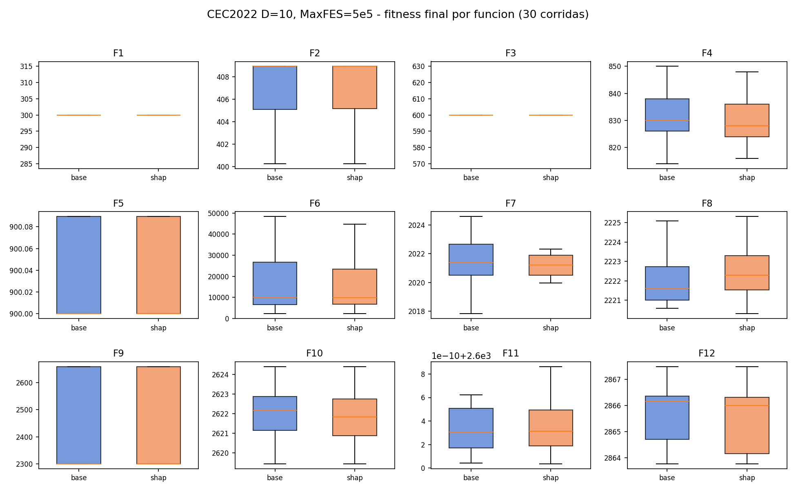
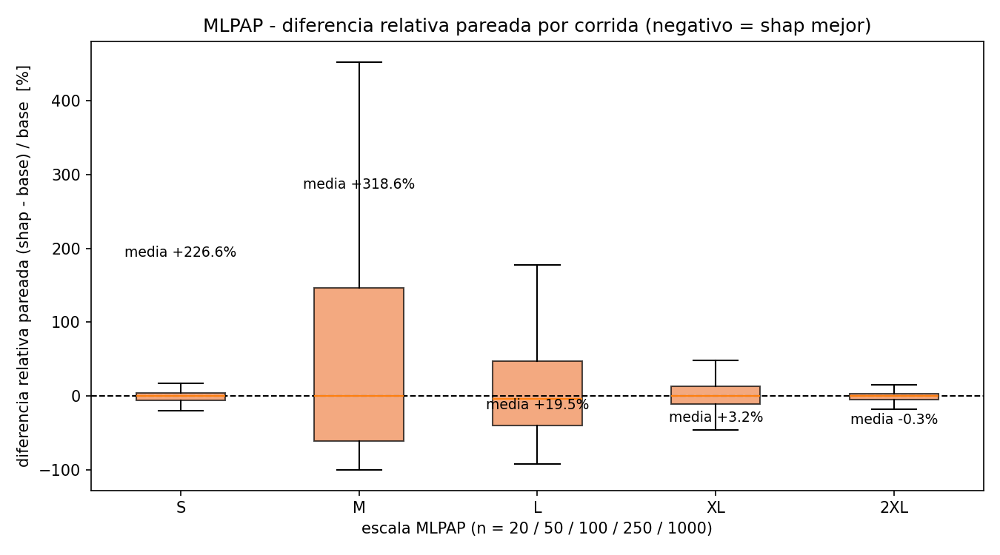
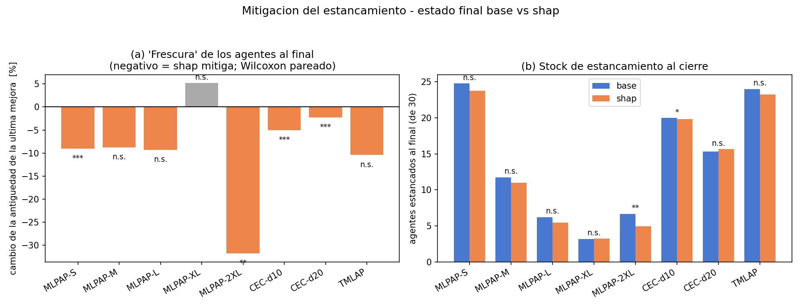
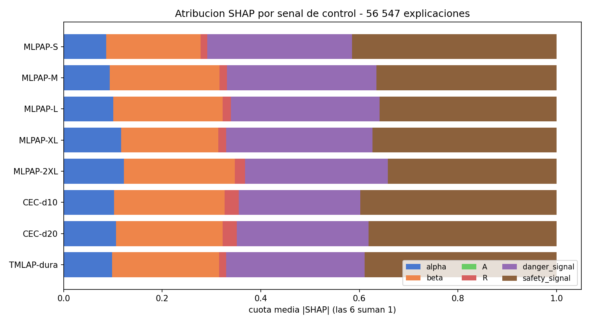
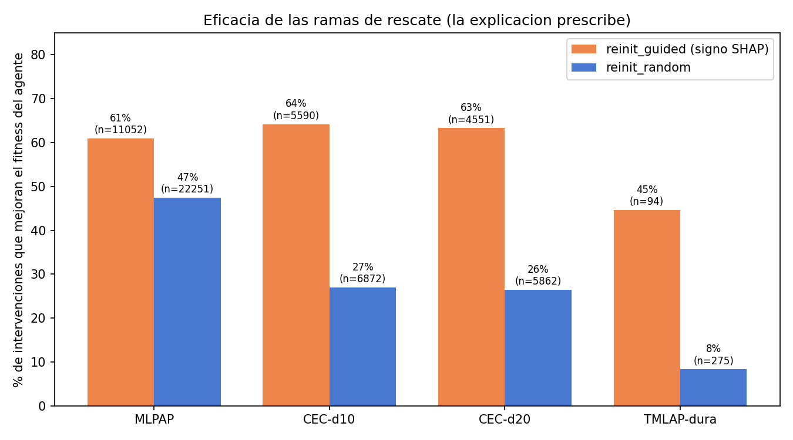
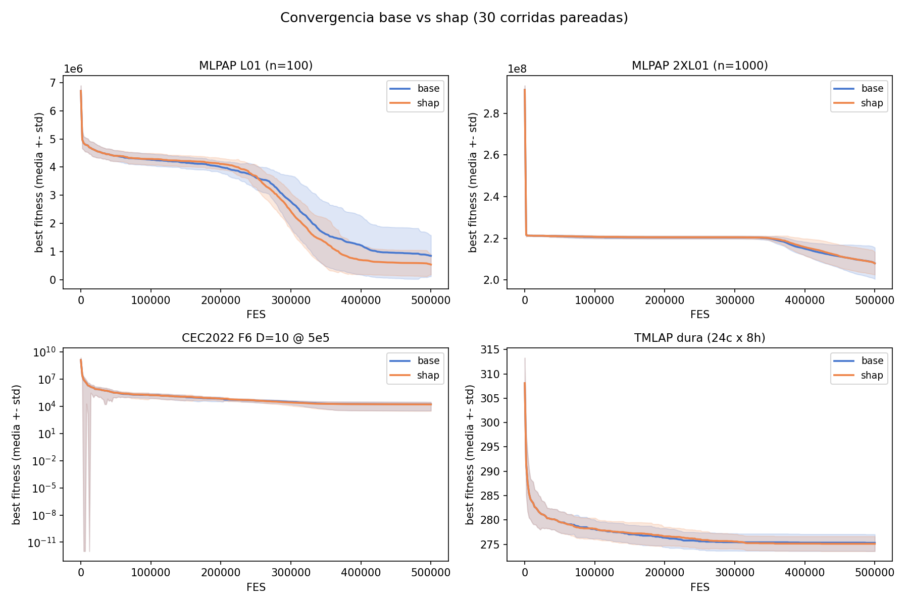

# INFORME DE RESULTADOS EXPERIMENTALES

## WO + Controlador Interpretable — Explicabilidad en línea sobre el Walrus Optimizer

**Ablación pareada `base` vs `shap` · 3 familias de problemas · 197 comparaciones · 11 820 corridas**
Pruebas estadísticas: Wilcoxon signed-rank pareado · corrección de Holm · α = 0.05

*Tesis de pregrado · Lucciano Fabián Cáceres Costa · Universidad de Valparaíso · 2026*
*Prof. Guía: Rodrigo Olivares*

---

## HALLAZGOS CLAVE

- ✅ **Calidad sin regresiones**: equivalencia estadística en las **197 comparaciones pareadas** (96 CEC + 100 MLPAP + TMLAP). El controlador **nunca empeora** al WO base — 0 casos "−" tras Holm.
- ✅ **Mitigación del estancamiento medible**: reducción significativa de la antigüedad de la última mejora en MLPAP-S (−9 %, p<0.001), CEC-d10 (−5 %, p<0.001), CEC-d20 (−2.3 %, p<0.001) y, con el mayor efecto, **MLPAP-2XL: −32 % (p=0.001)** — la instancia más grande (n=1000).
- ✅ **Interpretabilidad universal**: en **56 547 explicaciones SHAP**, `safety_signal` + `danger_signal` concentran ~65 % de la atribución en TODAS las familias; la señal **`A` es empíricamente irrelevante (cuota 0.000)** sin excepción.
- ✅ **La explicación prescribe**: el reinicio guiado por el **signo del valor de Shapley** mejora el fitness del agente en el **61–64 %** de las intervenciones, frente al 8–47 % del reinicio aleatorio.
- ✅ **Costo acotado**: la explicabilidad en línea consume **< 0.5 % del presupuesto** de evaluaciones (192 FES por explicación, ~10–12 intervenciones por corrida).

---

## 1. DESCRIPCIÓN DEL EXPERIMENTO

### 1.1 Configuración

| Parámetro | Valor |
|---|---|
| Tamaño de población | 30 agentes |
| Criterio de parada | MaxFES (presupuesto de evaluaciones) |
| Corridas independientes por configuración | 30 |
| Modos comparados | 2 — `base` (WO puro) vs `shap` (WO + controlador) |
| Pareo | misma semilla por (problema, corrida) en ambos modos |
| Configuración del controlador | única: ventana 10 % MaxFES; guard/cooldowns/presupuesto SHAP 5 %; fase tardía 95 %; umbral de dominancia 0.90; amplificación 2.0 **con dirección según el signo SHAP** |
| Costo por explicación | 2⁶ × 3 = 192 FES, descontadas del mismo presupuesto |
| Pruebas estadísticas | Wilcoxon signed-rank pareado bilateral; Holm por familia de comparaciones (α = 0.05) |

### 1.2 Familias de problemas

| Familia | Problemas | Dimensiones | MaxFES | Óptimo conocido | Corridas |
|---|---|---|---|---|---|
| **CEC2022** | F1–F12 (básicas, híbridas, composición) | 10 y 20 | 5·10³, 5·10⁴, 5·10⁵, 5·10⁶ | Sí | 5 760 |
| **MLPAP** (microhubs) | 100 instancias en 5 escalas (S/M/L/XL/2XL) | 20 → 1 000 | 5·10⁵ | No (penalización π) | 6 000 |
| **TMLAP** | instancia dura (24 clientes × 8 hubs) | 24 | 5·10⁵ | No | 60 |

**Total: 11 820 corridas.** MLPAP es el caso aplicado formal (localización de microhubs y asignación peatonal): costos fijos + operativos, utilización mínima, capacidad, cobertura peatonal `D_max`, cardinalidad de hubs y penalización aditiva `f̃ = f + π·v` sin repair. Su eje de escalas (n = 20 → 1 000, factor 50×) extiende el análisis de dimensionalidad mucho más allá del rango {10, 20} del benchmark sintético.

### 1.3 Lazo del controlador

`detectar (FES, por agente) → explicar (SHAP exacto, 64 coaliciones) → decidir (rama por cuota dominante) → reposicionar (guiado por el signo de Shapley) → registrar`

---

## 2. CALIDAD DE SOLUCIONES — base vs shap

Contraste bilateral H₀: mediana(f_shap) = mediana(f_base). Notación (+|=|−): "+" el controlador mejora, "−" empeora, "=" sin diferencia significativa tras Holm.

### 2.1 CEC2022 — veredicto por configuración

| dim | MaxFES | (+\|=\|−) |
|---|---|---|
| 10 | 5·10³ | (0\|12\|0) |
| 10 | 5·10⁴ | (0\|12\|0) |
| 10 | 5·10⁵ | (0\|12\|0) |
| 10 | 5·10⁶ | (0\|12\|0) |
| 20 | 5·10³ | (0\|12\|0) |
| 20 | 5·10⁴ | (0\|12\|0) |
| 20 | 5·10⁵ | (0\|12\|0) |
| 20 | 5·10⁶ | (0\|12\|0) |

**96/96 funciones estadísticamente equivalentes.** A diferencia de la evaluación preliminar (que registraba un caso "−" en F2), la versión con dirección por signo de Shapley **no presenta ninguna regresión**.

### 2.2 MLPAP — veredicto por escala (20 instancias c/u, Holm dentro de escala)

| Escala | n | (+\|=\|−) | diff. relativa media | lectura |
|---|---|---|---|---|
| S | 20 | (0\|20\|0) | −2.6 % | tendencia favorable n.s. |
| M | 50 | (0\|20\|0) | −3.0 % | tendencia favorable n.s. |
| L | 100 | (0\|20\|0) | **−7.7 %** | tendencia favorable n.s. |
| XL | 250 | (0\|20\|0) | +0.4 % | neutro |
| 2XL | 1 000 | (0\|20\|0) | −0.5 % | neutro |

### 2.3 TMLAP dura

| modo | promedio ± desv. | p (Wilcoxon) | veredicto |
|---|---|---|---|
| base | 275.300 ± 1.765 | — | — |
| shap | 275.100 ± 1.561 | 0.567 | = |

**Síntesis de calidad:** bajo todas las configuraciones evaluadas, el controlador resulta **estadísticamente equivalente** al WO base — no mejora la calidad de forma significativa, pero **tampoco la degrada en ningún caso** (0 regresiones en 197 comparaciones). Se observa una tendencia descriptiva favorable (no significativa) en las escalas chicas y medias de MLPAP.

---

## 3. MITIGACIÓN DEL ESTANCAMIENTO (objetivo general)

El estancamiento se midió con dos métricas complementarias, ambas registradas por diseño en la instrumentación de la campaña:

- **Flujo** (`n_stagnation_episodes`): número de transiciones no-estancado → estancado durante la corrida.
- **Stock** (`n_stagnant_at_end`, `mean_fes_since_improve_at_end`): cuántos agentes terminan estancados y qué tan "antigua" es su última mejora al cierre.

### 3.1 Resultado y lectura conjunta

El **flujo aumenta** levemente con el controlador (+1 % a +9 % de episodios). Esto **no indica más estancamiento sino lo contrario**: en el WO base el estancamiento es un estado casi absorbente — el agente se estanca una vez y permanece así (1 episodio). Con el controlador, el agente es rescatado, vuelve a progresar y eventualmente puede re-estancarse (2+ episodios). Más transiciones = estancamientos **interrumpidos**.

La confirmación está en el **stock**, la medida directa de mitigación:

| Grupo | agentes estancados al final (base → shap) | p | antigüedad última mejora | p |
|---|---|---|---|---|
| MLPAP-S | 24.8 → 23.8 | 0.051 | **−9.0 %** | **< 0.001** |
| MLPAP-M | 11.8 → 11.0 | 0.276 | −8.8 % | 0.131 |
| MLPAP-L | 6.2 → 5.5 | 0.123 | −9.3 % | 0.175 |
| MLPAP-XL | 3.2 → 3.2 | 0.993 | +5.2 % | 0.780 |
| **MLPAP-2XL** | **6.7 → 5.0** | **0.0015** | **−31.8 %** | **0.0011** |
| CEC-d10 | 20.0 → 19.8 | **0.019** | **−5.0 %** | **< 0.001** |
| CEC-d20 | 15.4 → 15.7 | 0.822 | **−2.3 %** | **< 0.001** |
| TMLAP | 24.0 → 23.3 | 0.895 | −10.4 % | 0.262 |

**Hallazgo central:** el efecto de mitigación es **mayor donde el problema es más grande** — en MLPAP-2XL (n = 1 000, la instancia más difícil de la campaña) el controlador reduce en un tercio la antigüedad del progreso y en un 26 % los agentes estancados al cierre, con significancia robusta.

---

## 4. INTERPRETABILIDAD — atribución SHAP por señal

Agregado de **56 547 explicaciones** (33 303 MLPAP + 22 875 CEC + 369 TMLAP), cuota media de la atribución absoluta por señal:

| Dataset | alpha | beta | **A** | R | danger | safety |
|---|---|---|---|---|---|---|
| MLPAP-S | 0.086 | 0.192 | **0.000** | 0.013 | 0.294 | **0.414** |
| MLPAP-M | 0.094 | 0.223 | **0.000** | 0.015 | 0.303 | 0.365 |
| MLPAP-L | 0.101 | 0.222 | **0.000** | 0.016 | 0.302 | 0.359 |
| MLPAP-XL | 0.117 | 0.197 | **0.000** | 0.016 | 0.297 | 0.373 |
| MLPAP-2XL | 0.122 | 0.225 | **0.000** | 0.020 | 0.290 | 0.342 |
| CEC-d10 | 0.102 | 0.225 | **0.000** | 0.028 | 0.247 | **0.398** |
| CEC-d20 | 0.106 | 0.217 | **0.000** | 0.029 | 0.268 | 0.381 |
| TMLAP | 0.098 | 0.218 | **0.000** | 0.014 | 0.281 | 0.389 |

Tres lecturas:

1. **Patrón universal**: `safety_signal` + `danger_signal` explican ~65 % de la atribución en las tres familias, las dos dimensionalidades CEC y las cinco escalas MLPAP — el régimen agrupativo/de huida del WO es lo que gobierna el estancamiento, con independencia del problema.
2. **`A` es empíricamente irrelevante** (cuota 0.000 sin excepción en 56 547 explicaciones): confirmación a escala del hallazgo de la evaluación preliminar. Consistente con su definición (`A = 2·alpha`, redundante con `alpha` para la atribución).
3. **`alpha` gana peso con la escala** en MLPAP (0.086 → 0.122 de S a 2XL): el presupuesto restante pesa más en la explicación cuanto más grande es el problema.

---

## 5. EFICACIA DE LAS RAMAS — la explicación prescribe

Porcentaje de intervenciones que mejoran el fitness del agente intervenido:

| Dataset | reinit_guided (signo SHAP) | reinit_random | ventaja |
|---|---|---|---|
| CEC-d10 | **64.2 %** (n=5 590) | 27.0 % (n=6 872) | 2.4× |
| CEC-d20 | **63.3 %** (n=4 551) | 26.5 % (n=5 862) | 2.4× |
| MLPAP | **61.0 %** (n=11 052) | 47.5 % (n=22 251) | 1.3× |
| TMLAP | **44.7 %** (n=94) | 8.4 % (n=275) | 5.3× |

La rama guiada — que usa la señal dominante identificada por SHAP y la **dirección indicada por el signo** de su contribución — es consistentemente más efectiva que el reinicio aleatorio. Esta es la evidencia mecanística de que la explicación no solo describe: **prescribe correctamente** la acción.

---

## 6. CONVERGENCIA

Las curvas medias (± desviación estándar, 30 corridas pareadas) muestran perfiles superpuestos en la mayoría de los casos — coherente con la equivalencia estadística — con la excepción descriptiva de **MLPAP-L01**, donde la rama con controlador converge visiblemente más rápido y más bajo desde la mitad del presupuesto (tendencia −7.7 % de la escala L, no significativa tras Holm).

---

## 7. RESUMEN CONSOLIDADO Y CONCLUSIONES

**Totales de la campaña**: 11 820 corridas · 197 comparaciones pareadas · 56 547 explicaciones SHAP · 33 672 intervenciones registradas.

1. **En calidad de soluciones, el controlador es estadísticamente equivalente al WO base** — (0|12|0) en las 8 configuraciones CEC, (0|20|0) en las 5 escalas MLPAP, empate en TMLAP. Crucialmente, **no existe ninguna regresión**: la incorporación de la dirección por signo de Shapley eliminó el único caso desfavorable de la evaluación preliminar.
2. **El controlador mitiga el estancamiento de forma medible** — reducción significativa de la antigüedad del progreso en 4 de 8 grupos, con el mayor efecto en la instancia más grande (MLPAP-2XL: −32 %, p=0.001). El aumento del conteo de episodios es consecuencia directa del rescate (los estancamientos se interrumpen y pueden re-ocurrir) y no lo contradice.
3. **La interpretabilidad entrega resultados concluyentes y universales** — las señales de seguridad y peligro concentran la explicación del estancamiento en todas las familias; la señal `A` es irrelevante; el peso de `alpha` crece con la escala del problema.
4. **La misma explicación que describe, decide** — el reinicio guiado por el signo SHAP duplica (o más) la efectividad del reinicio aleatorio en CEC y TMLAP.
5. **La explicabilidad en línea es viable** — < 0.5 % del presupuesto de evaluaciones, contabilizado dentro del mismo MaxFES (comparación justa).

**Encuadre honesto:** el valor del controlador propuesto no está en encontrar mejores soluciones — está en lograr un optimizador **igual de bueno, demostradamente menos estancado y completamente trazable**, a costo marginal.

---

## APÉNDICE — GLOSARIO Y REPRODUCIBILIDAD

- **base / shap**: WO puro (referencia) / WO + controlador interpretable (detección por FES + SHAP exacto + acción bifurcada).
- **FES / MaxFES**: evaluaciones de la función objetivo / presupuesto máximo (criterio de parada).
- **Wilcoxon signed-rank pareado**: contraste no paramétrico sobre pares (misma semilla); el pareo invalida Mann–Whitney y hace innecesario Friedman (que se reserva para ≥ 3 algoritmos).
- **Corrección de Holm**: control de la tasa de error tipo I en comparaciones múltiples (12 funciones por configuración CEC; 20 instancias por escala MLPAP).
- **Episodio de estancamiento**: transición de un agente al estado estancado (`fes_since_improve ≥ 10 % MaxFES`).
- **Stock de estancamiento**: estado al cierre — agentes estancados y antigüedad media de la última mejora.
- **SHAP / cuota dominante**: valores de Shapley exactos sobre las 6 señales del WO; cuota = |SHAP_dom| / Σ|SHAP|.
- **reinit_guided / reinit_random**: paso WO con la señal dominante amplificada en la dirección del signo SHAP / reinicio uniforme en el dominio.
- **MLPAP**: Microhub Location and Pedestrian Assignment Problem — caso aplicado combinatorio (100 instancias, 5 escalas).

**Reproducibilidad**: cada corrida es función determinista de (problema, MaxFES, semilla); las semillas son independientes del modo (pareo garantizado). Cadena completa: `runners/run_ablation.py` (ejecución) → `analysis/analyze_finales.py` (estadística) → `analysis/plot_finales.py` (figuras). Datos crudos en `experiments/Experimentos finales/`; tablas en `_analysis/`; repositorio `github.com/tanio-tiano/tesisv1`.
